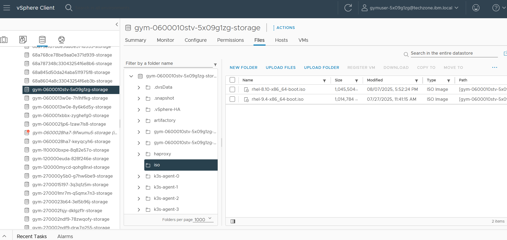

<!--
© Broadcom. All Rights Reserved.
The term “Broadcom” refers to Broadcom Inc. and/or its subsidiaries.
SPDX-License-Identifier: BSD-2-Clause
-->

<!-- markdownlint-disable first-line-h1 no-inline-html -->


# Packer RHEL 8 & 9 for VMware vSphere

This repository is based off of [Packer Examples for vSphere](https://github.com/vmware/packer-examples-for-vsphere). The repository has been updated and tested for building
RHEL 8 & 9 images on vSphere, though the rest of the examples are still present here. This can be used to automate the creation of virtual machine images for VMware vSphere environments.

## Environment Requirements

### Red Hat ISO Options: Boot vs Full DVD

This build supports installation using either a boot ISO or the full DVD ISO for RHEL.

- **Boot ISO:**
 Much smaller in size (~1GB), making it significantly faster to download and upload to vSphere. However, it requires an **online installation**, which means you must provide a valid Red Hat Activation Key and Organization ID. These credentials are typically available through a **Red Hat Partner Connect account** or a paid subscription.

- **Full DVD ISO:**
 Over 10GB in size, which can take considerable time to download and upload to your virtualization platform. This ISO supports offline installation, so it does not require RHSM Activation Key and Organization ID. Use this option if you do not have access to a Partner Connect account.

If you have access to a Partner Connect account, using the boot ISO is the recommended and most efficient option.

See below section [Red Hat Subscription Manager](#red-hat-installation-methods-online-and-offline) for details on how to verify if you have a Partner Connect account.

### Platform

The project is tested on the following platforms:

| Platform        | Version               |
| --------------- | --------------------- |
| VMware vSphere  | 7.0 Update 3D or later|

### Operating Systems

The project is tested on the following operating systems for the Packer host :

| Operating System   | Version   | Architecture           |
| :----------------- | :-------- | :--------------------- |
| RHEL               | 8.7       | `x86_64`               |

### Access to vSphere

You will need access to VMware vSphere with proper [privileges](https://vmware.github.io/packer-examples-for-vsphere/getting-started/privileges/).

#### Accessing VMware vSphere via IBM TechZone
**If you are an IBMer or Business Partner**, you can request access to a vSphere environment through IBM TechZone that will automatically give you the privileges needed.

- Navigate to the [VMware on IBM Cloud Environments](https://techzone.ibm.com/collection/tech-zone-certified-base-images/journey-vmware-on-ibm-cloud-environments).

- Select Request vCenter access (OCP Gym) to get a reservation.

Tip: If you are using TechZone, it is recommended to enabled VPN when making the reservation (this avoids the need for access to the environment through guacamole).

### Download RHEL 8 or 9 Boot ISO
This guide provides instructions for downloading the Red Hat Enterprise Linux (RHEL) 8 or 9 image ISO. Remember to
select your image (boot vs full DVD) based on whether you have Partner Connect access to an activation key.

**Step 1: Create a Red Hat Developer Account**

Before you can download any RHEL images, you need a free Red Hat Developer account.

1. Navigate to the Red Hat Developer program website.

2. Click "Register" or "Join the Red Hat Developer Program."

3. Fill out the required information to create your account.

4. Confirm your email address.

**Step 2: Navigate to the RHEL Downloads Page**

Once you have an account, you can access the download portal.

1. Log in to the Red Hat Customer Portal.

2. Go to the Product Downloads section.

3. On the product list, select "Red Hat Enterprise Linux".

**Step 3: Select the Correct ISO Image**

The RHEL downloads page offers several options. You'll want to choose the boot ISO for your needs. **YOU MAY HAVE TO SCROLL DOWN TO SEE PREVIOUS RHEL VERSIONS**

1. On the RHEL downloads page, select the desired version (e.g., RHEL 9 or RHEL 8).

2. Under the list of available downloads, select either "Boot ISO" or "Full DVD" version.

3. The file name will typically follow a pattern like `rhel-9.x-x86_64-boot.iso` or `rhel-8.x-x86_64-boot.iso` for the boot ISO and `rhel-9.x-x86_64-dvd.iso` or `rhel-9.x-x86_64-dvd.iso` for the full DVD.

4. Click the "Download" button next to the appropriate file to begin the download.

**Note on ISO types:**

 Boot ISO: A small file (typically one gigabyte) that contains only the core installer. It requires an active internet connection during installation to fetch the necessary packages. This is ideal for network installations.

 DVD ISO: A much larger file (several gigabytes) that contains the full installation and a wide selection of software packages. This allows for an offline installation.

### Upload ISOs

While the file downloads, you can continue to the next steps and start setting up packer on the bastion. Periodically check
the download and when it's finished come back to this section and start the upload to vSphere. The upload can take over an hour
especially if using the full DVD iso and offline installation method.

Upload the guest operating system ISO file to a datastore in VMware vSphere. Create a directory called `iso` and
upload the file there.




### Packer

| Component                                                        | Version   | Description      |
| :--------------------------------------------------------------- | :-------- | :--------------- |
| Packer                              | >= 1.12.0 | By HashiCorp     |
| Packer Plugin for Ansible        | >= 1.1.2  | By HashiCorp     |
| Packer Plugin for VMware vSphere | >= 1.4.2  | By HashiCorp     |
| Packer Plugin for Git      | >= 0.6.3  | Community Plugin |


#### Installation

##### RHEL 8

You can install Packer on RHEL 8 using the following commands:

```shell
sudo yum install -y yum-utils
sudo yum-config-manager --add-repo https://rpm.releases.hashicorp.com/RHEL/hashicorp.repo
sudo yum install -y packer
```

<details>
<summary>Ubuntu</summary>

You can install Packer on Ubuntu using the following commands:.

1. Configure the repository:

```shell
sudo bash -c 'wget -O- https://apt.releases.hashicorp.com/gpg | gpg --dearmor > /usr/share/keyrings/hashicorp-archive-keyring.gpg'
```

2. Verify the fingerprint:

```shell
gpg --no-default-keyring --keyring /usr/share/keyrings/hashicorp-archive-keyring.gpg --fingerprint
```

You can verify that the fingerprint matches the HashiCorp public key published on
[Security at HashiCorp][hcp-security].

3. Add the official HashiCorp repository to your system:

```shell
sudo bash -c 'echo "deb [signed-by=/usr/share/keyrings/hashicorp-archive-keyring.gpg] \
https://apt.releases.hashicorp.com $(lsb_release -cs) main" > /etc/apt/sources.list.d/hashicorp.list'
```

4. Install Packer from the HashiCorp repository:

```shell
sudo apt update && sudo apt install packer
```
</details>

<details>
<summary>macOS</summary>

You can install Packer on macOS using [Homebrew][homebrew].

```shell
brew tap hashicorp/tap
brew install hashicorp/tap/packer
```
</details>

##### Note

Required plugins are automatically downloaded and initialized when using `./build.sh`.

For disconnected sites you may download the plugins and place these same directory as your Packer
executable `/usr/local/bin` or `$HOME/.packer.d/plugins`.

### Additional Packages

The following additional software packages must be installed on the operating system running Packer.

| Package       | Version   | Description                                     | Resources                                      |
| :------------ | :-------- | :---------------------------------------------- | :--------------------------------------------- |
| ansible-core  | >= 2.16   | Automation engine for IT infrastructure         | [Ansible Documentation](https://docs.ansible.com/) |
| git           | >= 2.43.0 | Version control system for tracking changes     | [Git Documentation](https://git-scm.com/doc)   |
| gomplate      | >= 4.3.0  | Template renderer                               | [Gomplate GitHub](https://github.com/hairyhenderson/gomplate) |
| jq            | >= 1.8.3  | Command-line JSON parser                        | [jq GitHub](https://github.com/stedolan/jq)    |
| terraform     | >= 1.10.0 | Infrastructure as Code (IaC) tool by HashiCorp  | [Terraform Documentation](https://www.terraform.io/docs) |
| xorriso       | >= 1.5.6  | ISO filesystem images creator for Linux         | [xorriso Man Page](https://linux.die.net/man/1/xorriso) |

#### Installation

##### RHEL 8

**Packages:**

```shell
sudo yum install -y epel-release
sudo yum install -y ansible-core jq git xorriso terraform
```

**Gomplate:**

```shell
export GOMPLATE_VERSION="4.3.0"
wget -q https://github.com/hairyhenderson/gomplate/releases/download/v${GOMPLATE_VERSION}/gomplate_linux-amd64
chmod +x gomplate_linux-amd64
sudo mv gomplate_linux-amd64 /usr/local/bin/gomplate
```

<details>
<summary>Ubuntu</summary>

**Packages:**

```shell
sudo apt update
sudo apt install software-properties-common
sudo add-apt-repository --yes --update ppa:ansible/ansible
sudo apt install -y python3 python3-pip ansible git jq xorriso whois unzip terraform
echo "ansible-core $(ansible --version | grep 'ansible.*core' | awk '{print $3}' | tr -d ']')"
echo "terraform $(terraform version | awk -Fv '{print $2}' | head -n 1)"
export PATH="$HOME/.local/bin:$PATH"
```

**Gomplate:**

```shell
export GOMPLATE_VERSION="4.3.0"
wget -q https://github.com/hairyhenderson/gomplate/releases/download/v${GOMPLATE_VERSION}/gomplate_linux-amd64
chmod +x gomplate_linux-amd64
sudo mv gomplate_linux-amd64 /usr/local/bin/gomplate
```
</details>

<details>
<summary>macOS</summary>

**Packages:**

```shell
brew install ansible git jq coreutils hashicorp/tap/terraform gomplate
echo "ansible-core $(ansible --version | grep 'ansible.*core' | awk '{print $3}' | tr -d ']')"
echo "terraform $(terraform version | awk -Fv '{print $2}' | head -n 1)"
export PATH="$HOME/.local/bin:$PATH"
```
</details>

## Get the Project

Download the latest release from GitHub.

### Clone the Repository

```shell
git clone https://github.com/ibm-client-engineering/packer-rhel-vsphere.git
cd packer-rhel-vsphere

```

### Project Structure

The directory structure of the project.

| Directory       | Description                                                                              |
| :---            | :---                                                                                     |
| **`ansible`**   | Contains the Ansible roles to prepare Linux machine image builds.                        |
| **`artifacts`** | Contains the OVF artifacts exported by the builds, if enabled.                           |
| **`builds`**    | Contains the templates, variables, and configuration files for the machine image builds. |
| **`manifests`** | Manifests created after the completion of the machine image builds.                      |
| **`scripts`**   | Contains the scripts to initialize and prepare Windows machine image builds.             |
| **`terraform`** | Contains example Terraform plans to create a custom role and test machine image builds.  |

## Configure Your Environment

### Example Variables

The project includes example variables files that you can use as a starting point for your own
configuration.

The [variables][packer-variables] are defined in `.pkrvars.hcl` files.

Run the config script `./config.sh` to copy the `.pkrvars.hcl.example` files to a `config`
directory.

```shell
./config.sh
```

The `config/` folder is the default folder. You can override the default by passing an alternate
value as the first argument.

### Configuration Variables

#### Datastore

Edit the `config/common.pkrvars.hcl` file to configure the location of the datastore for the boot ISO.

```hcl title="config/common.pkrvars.hcl"
common_iso_datastore               = "gym-0600010stv-5x09g1zg-storage"
common_iso_content_library         = ""
common_iso_content_library_enabled = false
```

Note: If you're part of a curated vSphere environment (such as IBM TechZone), you may be assigned specific datastores and resource pools. The value for `common_iso_datastore` should reflect the name of the datastore you've been granted access to.
In the example above, "gym-0600010stv-5x09g1zg-storage" is a sample name provided to a specific group — your assigned datastore name may differ.

Edit either `config/linux-rhel-9.pkrvars.hcl` or `config/linux-rhel-8.pkrvars.hcl` appropriately and
update the ISO path and file for each guest operating system in the configuration variables.

```hcl title="config/linux-rhel-9.pkrvars.hcl"
iso_datastore_path       = "iso"
iso_content_library_item = ""
iso_file                 = "rhel-9.4-x86_64-boot.iso"
```

#### Build

Edit the `config/build.pkrvars.hcl` file to configure the credentials for the default account on
machine images.

Replace the example passwords and keys.

**config/build.pkrvars.hcl**
```hcl
// Default Account Credentials
build_username           = "packer"
build_password           = "VMw@re123!"
build_password_encrypted = "$6$KspR8KgZFVxDOiiF$n4hhyeSGgamrz25mqvOfnK5xm6blwDJftlQZy0H60pwRdPKXsf996/lLzFrfW0H/ZHoE.jEPgVmFZpmgce6jX0"
build_key                = "ecdsa-sha2-nistp521 AAAAE2VjZHNhLXNoYTItbmlzdHA1MjEAAAAIbmlzdHA1MjEAAACFBADwXV3rbRCWwhSr6aMkHukV5O7OGAEyUtAerj2anJHm3mwbOxlBU/uO4f0ELqo2GJcTALMC0aFrbvu9qonIH5VF7wBBfCP1cS5B92sUagVV9ldI/uo89e/7dVYC9maPsFaZq2G0/PLU0hZKOohq99Oxc2RMSiJaaenX/hNqx5xYSaK+CA== packer@example.com"
```

**Optional**: You can use the default username and password instead of generating a new `build_password` and `build_password_encrypted`.

To generate a SHA-512 encrypted password for the `build_password_encrypted` using OpenSSL.

```shell
SALT=$(openssl rand -base64 6); \
ENCRYPTED_PASSWORD=$(echo -n "<your_password>" | openssl passwd -6 -stdin -salt $SALT); \
echo "Generated Salt: $SALT"; \
echo "Encrypted Password: $ENCRYPTED_PASSWORD"
```

The following output is displayed:

```shell
Generated Salt: <generated_salt>
Encrypted Password: <encrypted_password>
```

Generate a public key for the `build_key` for public key authentication.

```shell
ssh-keygen -t ecdsa -b 521 -C "<name@example.com>"
```

The following output is displayed:

```shell
Generating public/private ecdsa key pair.
Enter file in which to save the key (/Users/example/.ssh/id_ecdsa):
Enter passphrase (empty for no passphrase): **************
Enter same passphrase again: **************
Your identification has been saved in /Users/example/.ssh/id_ecdsa.
Your public key has been saved in /Users/example/.ssh/id_ecdsa.pub.
```

Copy the contents of `~/.ssh/id_ecdsa.pub` and set the `build_key` in `build.pkrvars.hcl`.

The content of the public key, `build_key`, is the key added to the `~/.ssh/authorized_keys` file of the `build_username` on the Linux guest operating systems.

#### Ansible

Edit the `config/ansible.pkrvars.hcl` file to configure the credentials for the Ansible account on
Linux machine images.

**config/ansible.pkrvars.hcl**

```hcl
ansible_username = "ansible"
ansible_key      = "<public_key>"
```

Copy the contents of `~/.ssh/id_ecdsa.pub` (generated above) and set the `ansible_key` in `ansible.pkrvars.hcl`.

**Ansible User Password:**

A random password is auto-generated for the Ansible user.

#### Common

Edit the `config/common.pkrvars.hcl` file to configure the following common variables:

```hcl
// Virtual Machine Settings
common_vm_version           = 19
common_tools_upgrade_policy = true
common_remove_cdrom         = true

// Template and Content Library Settings
common_template_conversion         = true
common_content_library             = ""
common_content_library_enabled     = false
common_content_library_ovf         = false
common_content_library_destroy     = false
common_content_library_skip_export = false

// OVF Export Settings
common_ovf_export_enabled   = false
common_ovf_export_overwrite = true

// Removable Media Settings
common_iso_datastore               = "gym-0600010stv-xxxxxxxx-storage"
common_iso_content_library         = ""
common_iso_content_library_enabled = false

// Boot and Provisioning Settings
common_data_source       = "http"
common_http_ip           = null
common_http_port_min     = 8000
common_http_port_max     = 8099
common_ip_wait_timeout   = "20m"
common_ip_settle_timeout = "5s"
common_shutdown_timeout  = "15m"

// HCP Packer
common_hcp_packer_registry_enabled = false
```

#### Data Source

The default provisioning data source for Linux machine image builds is `http`. This is used to serve the kickstart files to the Linux guest operating system during the build.

**config/common.pkrvars.hcl**

```hcl
common_data_source = "http"
```

#### HTTP Binding (Optional)

If you need to define a specific IPv4 address from your host for Packer's built-in HTTP server,
modify the `common_http_ip` variable from `null` to a `string` value that matches an IP address on
your Packer host.

**config/common.pkrvars.hcl**

```hcl
common_http_ip = "192.168.252.2"
```

#### VMware vSphere

Edit the `config/vsphere.pkrvars.hcl` file to configure the following:

```hcl
// vSphere Credentials
vsphere_endpoint            = "ocpgym-vc.techzone.ibm.local"
vsphere_username            = "gymuser-xxxxxxxx@techzone.ibm.local"
vsphere_password            = "xxxxyyyy"
vsphere_insecure_connection = true

// vSphere Settings
vsphere_datacenter            = "IBMCloud"
vsphere_cluster               = "ocp-gym"
//vsphere_host                = "" // Leave commented out; Packer will use DRS to pick a host
vsphere_datastore             = "gym-0600010stv-xxxxxxxx-storage"
vsphere_network               = "gym-0600010stv-xxxxxxxx-segment"
vsphere_folder                = "ocp-gym/gym-0600010stv-xxxxxxxx"
vsphere_resource_pool         = "Cluster Resource Pool/Gym Member Resource Pool/gym-0600010stv-xxxxxxxx"
vsphere_set_host_for_datastore_uploads = false
```

### Firewall

Packer includes a built-in HTTP server that is used to serve the kickstart files for Linux
machine image builds.

If a firewall is enabled on your Packer host, you will need to open `common_http_port_min` through
`common_http_port_max` ports (default is 8000-8099).

**RHEL 8:**

```shell
sudo firewall-cmd --zone=public --permanent --add-port=8000-8099/tcp
sudo firewall-cmd --reload
```

<details>
<summary>Ubuntu:</summary>

```shell
sudo ufw allow 8000:8099/tcp
sudo ufw reload
```
</details>

### Red Hat Installation Methods (Online and Offline)

This Packer build supports both online and offline installation methods for Red Hat Enterprise Linux (RHEL). Both methods are designed to build a complete system image, but they differ in how they obtain the necessary packages.

In either scenario, you must provide a **username and password** that will be used for the base operating system's build user.

#### Online Installation

This method uses a minimal boot ISO image to fetch all packages directly from Red Hat's Content Delivery Network (CDN) during the build. This ensures you are always installing the latest, most up-to-date packages and security patches. This approach also eliminates the need to download and upload a large 10+ GB full DVD ISO, making the process faster and more efficient.

**Prerequisites:**
To successfully complete an online build, you must have an active, paid Red Hat subscription or a Partner Connect account and provide your Red Hat Subscription Management credentials.

- **RHSM Credentials:** Your Red Hat Subscription Management username and password. This is typically your login credentials to Red Hat.

- **Organization ID:** The unique identifier for your Red Hat organization.

- **Activation Key:** A specific key used to register and attach the system to your subscription, ensuring it can access the software repositories.

#### Offline Installation

#### Configure the Variables
Regardless of your chosen installation method, you will need to edit the config/rhsm.pkrvars.hcl file to provide the necessary information. For an online installation, you must fill in all fields. For an offline installation, you can leave the rhsm_org and rhsm_key fields empty.

```hcl
// Red Hat Subscription Manager Credentials
rhsm_username = "myusername"
rhsm_password = "myredhatpasswordformyusername"

// Red Hat Subscription Manager Activation (required for online install only)
rhsm_org = "12123429"
rhsm_key = "packer-rhel9-key"
```

This method uses a full DVD ISO image that contains all the packages needed to install RHEL. This approach is ideal for environments with no internet access or for times when you need to ensure the build is from a specific version without any subsequent updates. With this method, you still need to provide your Red Hat credentials to set up the system's user account, but no activation key or internet connection is required during the build process itself.

**Note:** The activation key is OS release-specific. An activation key for RHEL 8 will not work for RHEL 9 and vice versa.

Note: This method is distinct from an offline installation, which would use a full DVD ISO containing all packages and would not require an internet connection or activation credentials during the build itself. The online method not only ensures you are installing the latest, most up-to-date packages and security patches but also prevents you from having to download and upload a 10+ GB full DVD ISO, which makes the entire process faster to implement.

## Build the Images

### Using the Build Script

Command to build a RHEL 8 server.

```bash
nohup ./build.sh --os Linux --dist "Red Hat Enterprise Linux" --version 8 --auto-continue >nohup.out 2>&1 </dev/null &
```

Command to build a RHEL 9 server.

```bash
nohup ./build.sh --os Linux --dist "Red Hat Enterprise Linux" --version 9 --auto-continue >nohup.out 2>&1 </dev/null &
```

Both of these commands start the build in the background, you can follow the output with `tail -f nohup.out`.

### How to Kill a Running Build

Assuming there are no other bash commands running in the background, use the following to kill a running build.

```bash
pkill packer && pkill bash
```

The build script is configured to leave partially or failed VMs running on vSphere. This is so you can troubleshoot easier.

### Build complete

When the build is complete you will see a template in vSphere.


# License

© Broadcom. All Rights Reserved. The term “Broadcom” refers to Broadcom Inc. and/or its subsidiaries.

Available under the Simplified BSD License.

Redistribution and use in source and binary forms, with or without modification, are permitted provided that the following conditions are met:

1. Redistributions of source code must retain the above copyright notice, this list of conditions and the following disclaimer.

2. Redistributions in binary form must reproduce the above copyright notice, this list of conditions and the following disclaimer in the documentation and/or other materials provided with the distribution.

THIS SOFTWARE IS PROVIDED BY THE COPYRIGHT HOLDERS AND CONTRIBUTORS "AS IS" AND ANY EXPRESS OR IMPLIED WARRANTIES, INCLUDING, BUT NOT LIMITED TO, THE IMPLIED WARRANTIES OF MERCHANTABILITY AND FITNESS FOR A PARTICULAR PURPOSE ARE DISCLAIMED. IN NO EVENT SHALL THE COPYRIGHT HOLDER OR CONTRIBUTORS BE LIABLE FOR ANY DIRECT, INDIRECT, INCIDENTAL, SPECIAL, EXEMPLARY, OR CONSEQUENTIAL DAMAGES (INCLUDING, BUT NOT LIMITED TO, PROCUREMENT OF SUBSTITUTE GOODS OR SERVICES; LOSS OF USE, DATA, OR PROFITS; OR BUSINESS INTERRUPTION) HOWEVER CAUSED AND ON ANY THEORY OF LIABILITY, WHETHER IN CONTRACT, STRICT LIABILITY, OR TORT (INCLUDING NEGLIGENCE OR OTHERWISE) ARISING IN ANY WAY OUT OF THE USE OF THIS SOFTWARE, EVEN IF ADVISED OF THE POSSIBILITY OF SUCH DAMAGE.

[//]: Links
[contributing]: CONTRIBUTING.md
[packer]: https://www.packer.io
[packer-plugin-vsphere]: https://developer.hashicorp.com/packer/plugins/builders/vsphere/vsphere-iso
[vmware-cla-dco]: https://cla.vmware.com/dco
[ansible]: https://docs.ansible.com
[git]: https://git-scm.com/downloads
[gomplate]: https://gomplate.ca/
[hcp-security]: https://www.hashicorp.com/security
[homebrew]: https://brew.sh/
[jq]: https://stedolan.github.io/jq/
[packer]: https://developer.hashicorp.com/packer
[packer-repo]: https://github.com/hashicorp/packer
[packer-plugin-ansible]: https://developer.hashicorp.com/packer/integrations/hashicorp/ansible
[packer-plugin-ansible-repo]: https://github.com/hashicorp/packer-plugin-ansible
[packer-plugin-git-docs]: https://developer.hashicorp.com/packer/integrations/ethanmdavidson/git
[packer-plugin-git-repo]: https://github.com/ethanmdavidson/packer-plugin-git
[packer-plugin-vsphere-docs]: https://developer.hashicorp.com/packer/plugins/builders/vsphere
[packer-plugin-vsphere-repo]: https://github.com/hashicorp/packer-plugin-vsphere
[terraform]: https://developer.hashicorp.com/terraform
[xorriso]: https://www.gnu.org/software/xorriso/
[iso]: https://en.wikipedia.org/wiki/ISO_imageGUID-58D77EA5-50D9-4A8E-A15A-D7B3ABA11B87.html
[packer-variables]: https://developer.hashicorp.com/packer/docs/templates/hcl_templates/variables
[vmware-pvscsi]: https://docs.vmware.com/en/VMware-vSphere/7.0/com.vmware.vsphere.hostclient.doc/GUID-7A595885-3EA5-4F18-A6E7-5952BFC341CC.html
[vmware-vmxnet3]: https://docs.vmware.com/en/VMware-vSphere/7.0/com.vmware.vsphere.vm_admin.doc/GUID-AF9E24A8-2CFA-447B-AC83-35D563119667.html
[Linux Distributions]: ../index.md#linux-distributions
